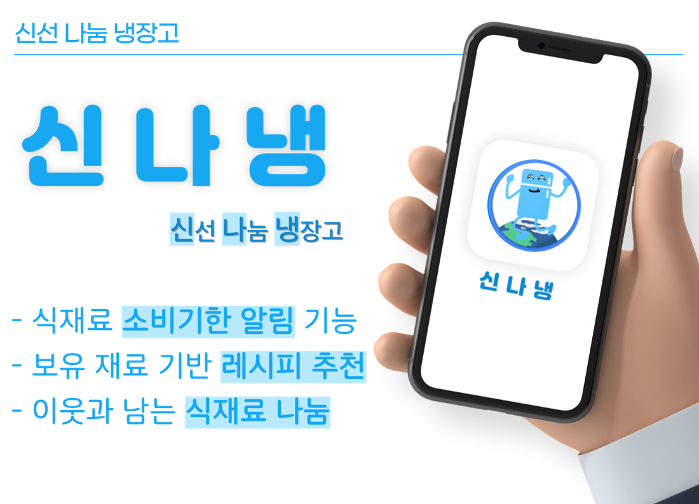
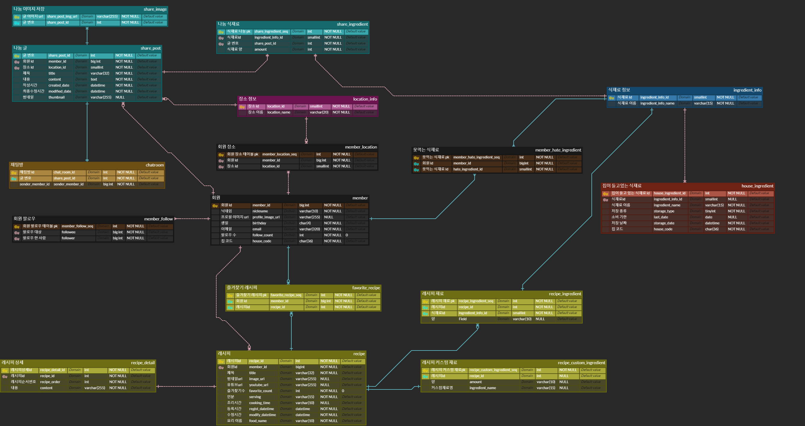
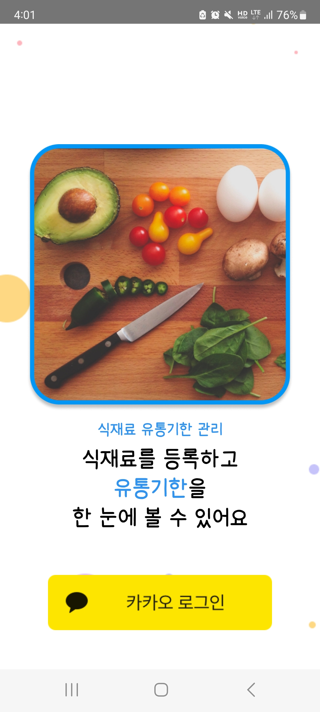
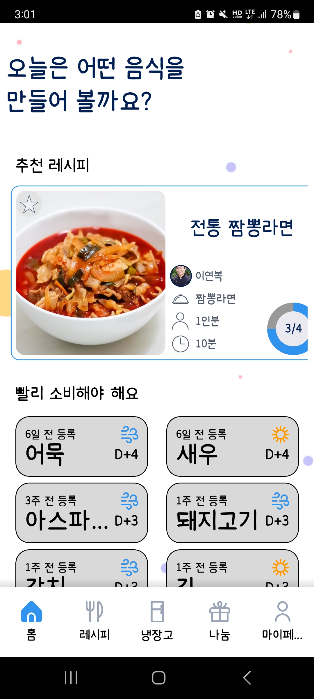
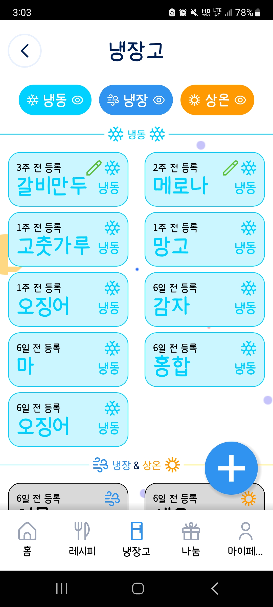
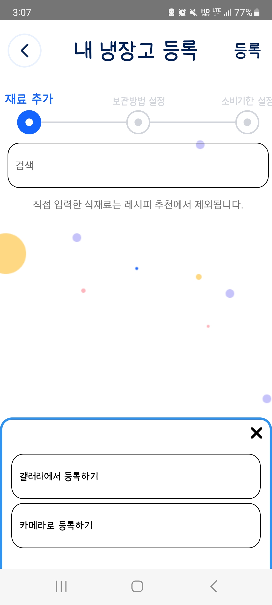
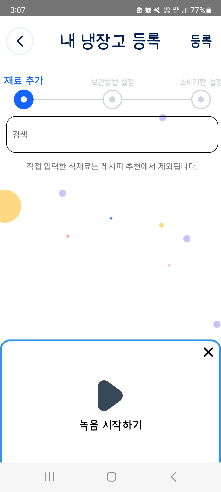
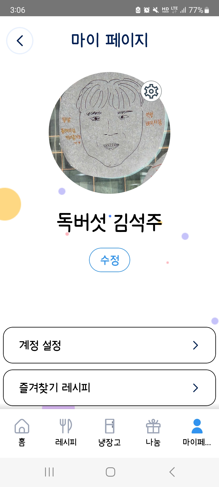

# 🧊 신선 나눔 냉장고, 신나냉

- 냉장고 식자재 관리 및 나눔 서비스
- [apk 다운로드](https://1drv.ms/u/s!AkrJpxi-ZmutiPNutUjyN42GvDJ0_A?e=c2RFwU)

# 📃목차

1. [프로젝트소개](#프로젝트-소개)
2. [개발 기간](#개발-기간)
3. [설계](#설계)
4. [주요기능](#주요-기능)
5. [시연](#시연)
6. [개발환경](#개발-환경)
7. [프로젝트 회고](#프로젝트-회고)
8. [팀원소개](#팀원-소개)

# 💡프로젝트 소개

### 서비스 소개

- 식재료의 소비기한을 추적해주고, 소비기한이 다가오면 사용처를 제공해, 최종적으로 버려지는 식재료를 줄일 수 있도록 도와주는 식재료 관리 어플

### 서비스 특징

- 기존의 식재료 관리 서비스들의 장점들을 모으고 단점을 개선하여 하나의 서비스로 만듬

- 식재료 등록에 편의성을 위해 영수증 촬영으로 구매한 목록을 한번에 추가하거나, 음성을 통해 간편하게 등록할 수 있음

- 가지고 있는 식재료를 기반으로 여러가지 레시피를 추천함

- 여러명이 하나의 냉장고를 공유하여 관리할 수 있음

### 기획 배경

#### 1. 기존 냉장고 관리 어플리케이션의 한계

- 기존의 냉장고 관리 어플리케이션은 식재료 등록이 번거롭고, 적절한 활용처를 제공해주지 않음

#### 2. 여러 명이 한 냉장고를 사용할 때의 어려움

- 가구 구성원끼리 냉장고를 공유하는 경우 정확한 식재료 파악이 어려움

#### 3. 소비 패턴의 변화와 그에 따른 식재료 폐기 증가

- 가구 구성원 수가 줄어들고 배달 문화가 발달하면서, 소비기한 내에 먹지 못하고 폐기되는 식재료의 양이 증가함
   

# 📆개발 기간

- 23.08.21일 - 23.10.06일

 

# 💡설계

### 1. ERD

### 2. 시스템 아키텍처

 

# ✨주요 기능

### 1. 식재료 관리

- 식재료를 등록해 소비기한을 추적함

- 남은 소비기한을 색깔별로 구분할 수 있음

- 남은 기간이 7일 미만인 식재료가 있을 경우 알림을 통해 사용할 수 있도록 도와줌

### 2. 레시피 추천

- 식재료 기반으로 레시피 추천

- 필수, 제외 재료 등 검색 필터 설정

- 필요한 식재료 갯수와 보유하고 있는 식재료의 갯수를 표시하여 선택에 도움을 줌

### 3. 식재료 나눔

- 소비가 어려운 식재료는 나눔을 통해 버리는 식재료를 줄일 수 있음

- 지역별로 나눔글 관리 가능

- 채팅을 통해 장소, 시간을 맞춘 후 수락, 거절 선택 가능

### 4. 공유 관리

- 여러 명이서 동시에 하나의 냉장고를 관리

- 회원 가입 시 집 코드를 공유하여 등록 가능

 

# 🔫시연

### 시연 영상

### 로그인

- 카카오톡 간편 회원가입, 로그인 구현

### 홈

- 레시피 추천 목록을 볼 수 있음

- 소비기한이 7일 미만인 식재료들 확인 가능

### 냉장고

 

- 보유하고 있는 식재료를 냉동, 냉장, 상온에 맞춰 표시해줌

- 남은 소비기한에 따라 색깔별로 표시해줌
  - 검정: 소비기한이 남지 않음
  - 빨강: 남은 소비기한 3일 미만
  - 노랑: 남은 소비기한 7일 미만
  - 초록: 남은 소비기한 7일 이상

### 식재료 등록

 

- 식재료 등록 시 텍스트를 입력하면 관리할 수 있는 식재료들의 목록을 자동완성할 수 있음

### 사진등록

- 사용자의 편의성을 증가시키기 위해 영수증 사진을 등록하면 해당 영수증에 있는 텍스트를 모두 읽어옴

- DB에 있는 식재료들과 비교하여 등록할 수 있는 식재료를 반환해줌

### 음성 등록

- 사용자의 편의성을 증가시키기 위해 음성을 통해 식재료를 등록할 수 있음

- 녹음을 시작한뒤 구매한 목록을 말하면, 해당 음성을 텍스트로 변환하고 그 중 DB에 있는 식재료와 비교하여 등록할 수 있는 식재료를 반환해줌

### 보관방법 설정

- 등록하려는 식재료들을 냉장, 냉동, 실온에 맞춰 자신이 보관할 장소에 분류할 수 있음

### 소비기한 설정

- 등록하려는 식재료들을 각각 소비기한을 설정할 수 있음

- 달력을 사용하여 사용자의 편의성을 증가시킴

### 레시피 목록

- 사용자들이 등록한 레시피를 최신순으로 확인할 수 있음

### 레시피 검색

 

- 가지고 있는 식재료를 목록으로 표시해주고 이 중, 레시피에 꼭 넣고 싶은 식재료를 선택할 수 있음

- 레시피에서 빼고싶은 식재료는 제외 식재료로 등록할 수 있음

- 회원 가입 시 기본적으로 항상 제외할 식재료를 입력 받을 수 있음

### 레시피 조회

 

- 레시피를 작성한 사람의 닉네임, 팔로우 수를 확인할 수 있음

- 간단한 레시피의 정보와 필요한 식재료들 확인 가능

- 보유중인 식재료는 파란색으로 표시, 소비기한을 표시하여 적절하게 사용할 수 있도록 유도함

- 조리 과정에 유튜브 링크가 등록이 되어있다면 영상 시청 가능

### 나눔글

 

- 지역별로 나눔을 등록한 글을 확인 가능

- 나눔을 하는 물건을 이미지로 확인 가능하고 채팅 신청을 할 수 있음

### 나눔 채팅

- 나눔을 하는사람과 받는사람이 채팅을 통해 약속 장소와 시간을 정함

- 양쪽 모두가 만족한다면 위의 확정 버튼을 통해 수락 가능

- 한명이라도 거절을 선택하면 해당 나눔은 기록되지 않음

### 마이페이지

 

- 사용자의 프로필과 닉네임 변경 가능

- 즐겨찾기 레시피 목록 확인 가능

- 계정 설정을 통해 내 지역 관리, 제외 식재료 관리 가능

- 계정 우리집 관리를 통해 집 코드를 확인할 수 있고, 이를 공유해 한 집의 식재료를 여러명이 동시에 관리할 수 있음

 

# 🛠개발 환경

### FrontEnd

### BackEnd

### Infra

### Development Tool

### Communication Tool

 

# 🖋프로젝트 회고

### MSA의 도입

    -

### S3 이미지 등록

    -

### 코드 컨벤션의 필요성

    -

### 느낀점

    -

 

# 👨‍👨‍👦‍👧팀원 소개

|                                                김석주                                                |                                               김수현                                               |                                               곽민규                                               |                                                금세현                                                 |                                              왕준영                                               |                                               윤태영                                                |
| :--------------------------------------------------------------------------------------------------: | :------------------------------------------------------------------------------------------------: | :------------------------------------------------------------------------------------------------: | :---------------------------------------------------------------------------------------------------: | :-----------------------------------------------------------------------------------------------: | :-------------------------------------------------------------------------------------------------: |
|  |  |  |  |  |  |
|                                       Leader Back-end                                        |                                           Back-end                                             |                                    Back-end Front-end                                      |                                             Back-end                                              |                                        Back-end Infra                                         |                                           Front-end                                             |

 
